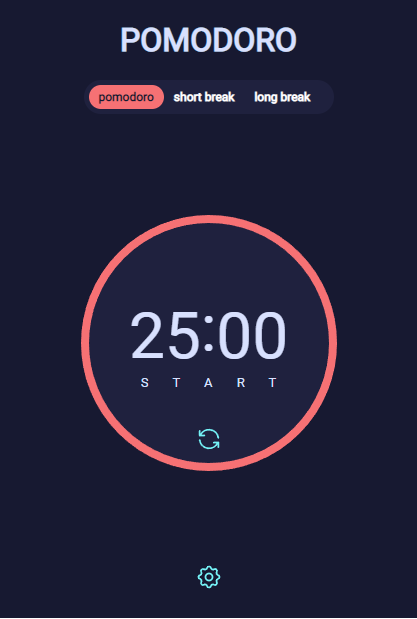

<h1 align="center">Pomodor app</h1>

<!-- TABLE OF CONTENTS -->

## Table of Contents

- [Overview](#overview)

- [Built With](#built-with)

- [How to use](#how-to-use)

<!-- OVERVIEW -->

## Overview



## Built With

<!-- This section should list any major frameworks that you built your project using. Here are a few examples.-->

- [React](https://reactjs.org/)
- [Typescript](https://www.typescriptlang.org/)

## How To Use

<!-- Example: -->

To clone and run this application, you'll need [Git](https://git-scm.com) and [Node.js](https://nodejs.org/en/download/) (which comes with [npm](http://npmjs.com)) installed on your computer. From your command line:

```bash
# Clone this repository
$ git clone https://github.com/rainmodred/Pomodoro.git

# Install dependencies
$ npm install

# Run the app
$ npm start
```
